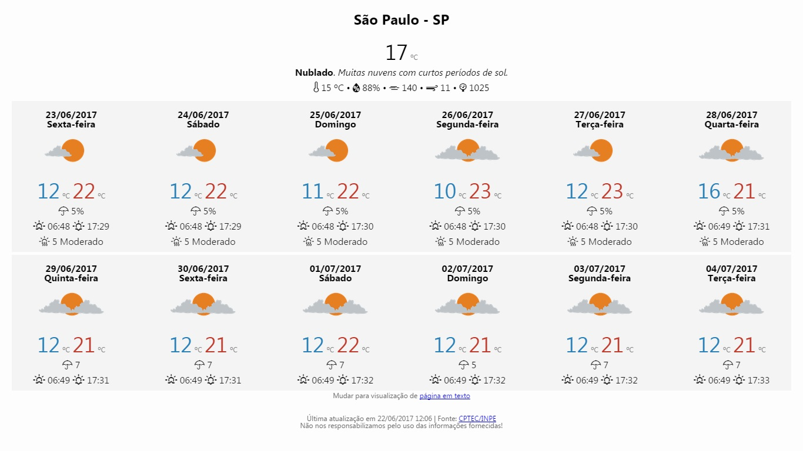

# Previsão em Nova Aba

O PNA é uma página para exibição da previsão do tempo para uma localidade, com uso de recursos para otimização de transferência e exibição de dados. O sistema foi desenvolvido na arquitetura MVC, onde o modelo de dados está devidamente separado do controle e da visualização das informações. A linguagem de programação foi o PHP. O sistema gerenciador de banco de dados foi MySQL. O paradigma de desenvolvimento foi o Orientado a Objetos.  

O PNA concentra as requisições na raiz de seu domínio (arquivo index.php). Com isso é criado um objeto da classe aplicação PNA. Os parâmetros informados são analisados e validados. Se o parâmetro da localidade estiver correto, a página web é criada e exibida para o usuário.  

Estão disponíveis dois diferentes tipos de páginas: página web e texto formatado. A página de texto formatado não possui imagens e utiliza uma marcação simples de HTML. A página de texto é mais leve no quesito carregamento. As páginas podem ser visualizadas em navegadores web de qualquer tipo de dispositivo. As informações estatísticas sobre os acessos são registrados pela ferramenta Google Analytics. Foram usadas bibliotecas externas como o Normalize, Skeleton etc.  

<kbd></kbd>

Os ícones flat de condições de tempo utilizados foram produzidos pelo projeto [PTFLATICON](https://github.com/mpsacademico/ptflaticon).   
A requisição de dados depende da aplicação [Lobrasil](https://github.com/mpsacademico/lobrasil).

## Linguagens, Ferramentas e Bibliotecas

- PHP, HTML, CSS e SQL (MySQL)
- Notepad++ e Chrome Web Browser
- Weather Icons, Normalize.css 5.0.0 e Skeleton 2.0.4

## Paleta de Cores

-  `#f4f4f4` quadro inicial
-  `#FFFFE0` quadro de listagem de cidades buscadas
-  `#4682B4` nomes de cidades buscadas
-  `#2980b9` temperaturas mínimas
-  `#c0392b` temperaturas máximas
-  `#696969` texto de rodapé

## Releases

v1.0.0.0 - Lançamento do PNA
