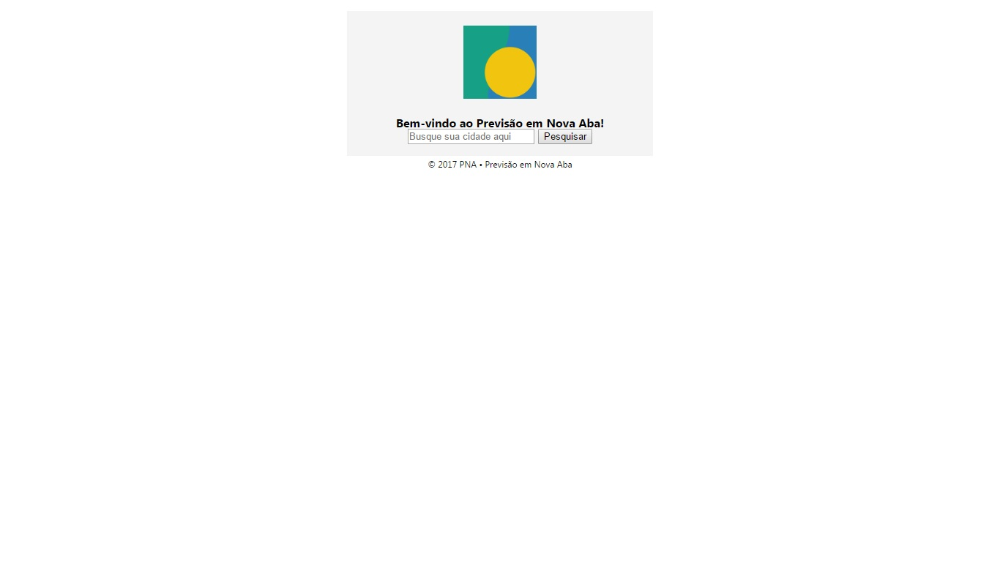
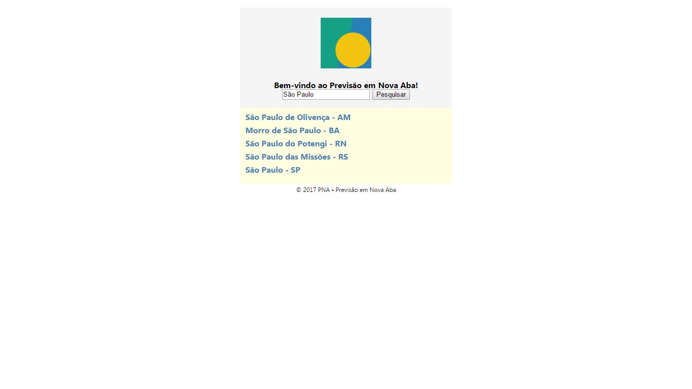
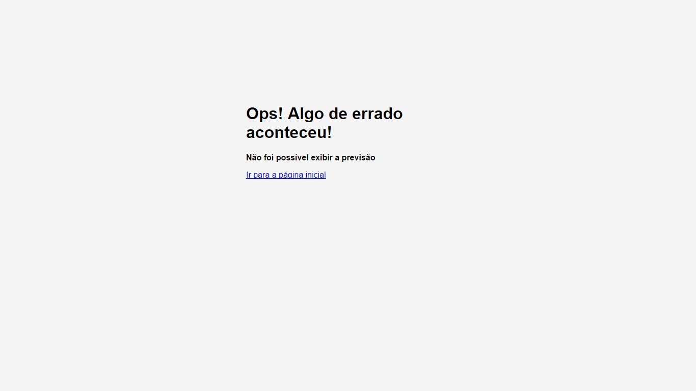

# Previsão em Nova Aba
O aplicativo PNA tem por objetivo apresentar a previsão de tempo de forma rápida e organizada.  
Este sistema web fez parte de um projeto de iniciação científica e apresentou bons resultados.

Os ícones flat de condições de tempo utilizados foram produzidos pelo projeto [PTFLATICON](https://github.com/mpsacademico/ptflaticon).  
A requisição de dados depende da aplicação [Lobrasil](https://github.com/mpsacademico/lobrasil).

<kbd></kbd>

<kbd></kbd>

<kbd></kbd>

<kbd></kbd>

## Linguagens e Ferramentas

- PHP, HTML, CSS e SQL (MySQL)
- Notepad++ e Chrome Web Browser
